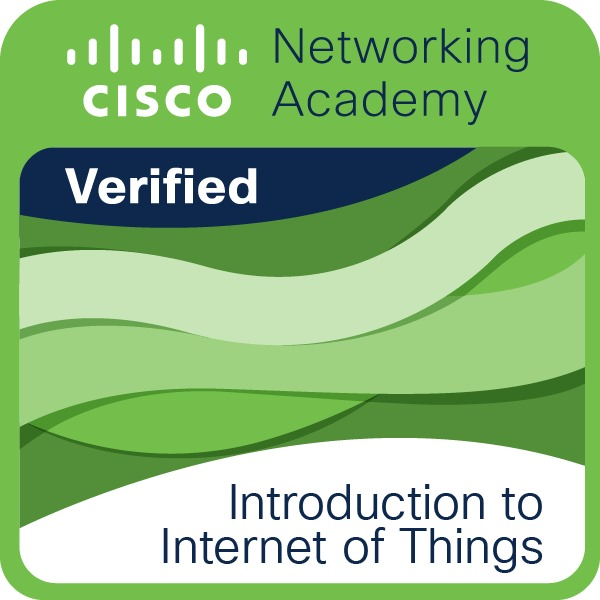
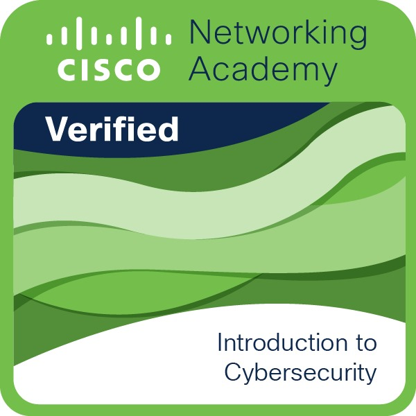
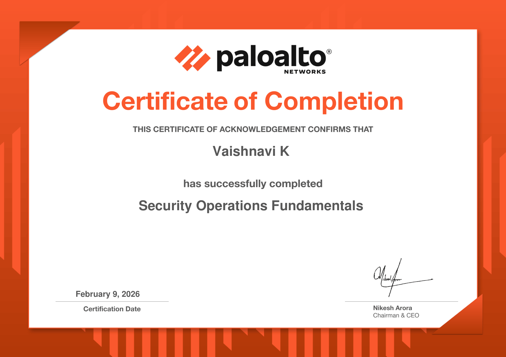
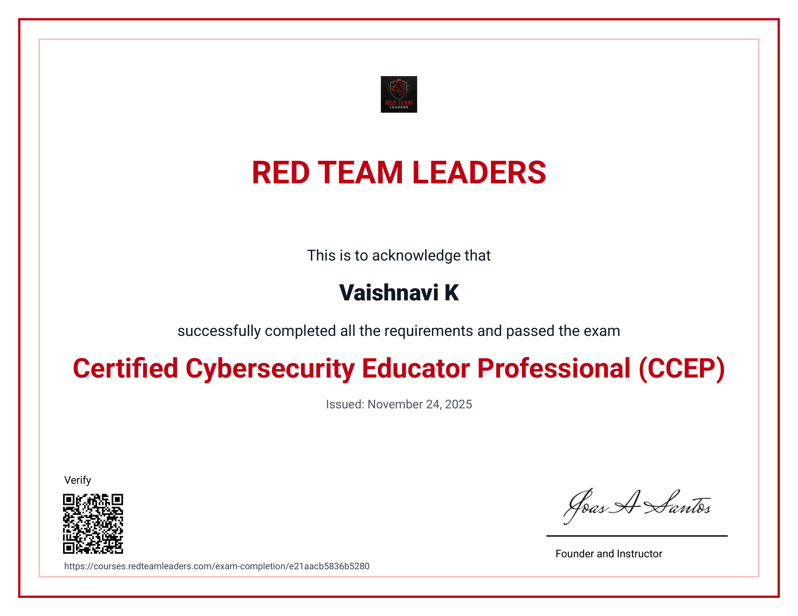

<h1 align="center">👩‍💻 Vaishnavi K</h1>

<h3 align="center">
Cyber Security | VAPT | Cloud Security | Web Application Security | IoT Security
</h3>

---

# 🧑‍💻 About Me

Pre-Final Year **B.E – CSE (Cybersecurity)** student at **SSM Institute of Engineering and Technology (SSMIET)** with hands-on learning in **Vulnerability Assessment and Penetration Testing (VAPT), threat analysis, and secure system design.**

Currently exploring **Cloud Security architectures, Web Application vulnerabilities (OWASP Top 10), and IoT security monitoring** to understand and mitigate real-world cyber threats.

---

# 📚 Current Learning

- AWS Security
- Vulnerability Assessment & Penetration Testing (VAPT)
- Web Application Security
- IoT Security Monitoring

---

# 🤝 Connect With Me

🔗 **LinkedIn**  
https://linkedin.com/in/vaishnavi0313

📧 **Email**  
vaishnavikannan036@gmail.com

💻 **GitHub**  
https://github.com/vaishnavi0313

---

# 💻 Languages

---

# 🛠 Development Tools

---

# 🔐 Cyber Security Tools

---

# 🖥 Operating Systems

---

# 🚀 Projects

### 🔹 AI Translator

**Problem:** Language barriers limit communication between users worldwide.

**Solution:** Developed a **Python-based AI translator using Googletrans API** supporting **100+ languages with real-time detection and translation.**

---

### 🔹 Intelligent Patient Health Monitoring System

**Problem:** Healthcare monitoring systems require real-time patient health tracking.

**Solution:** Built an **ESP32-based IoT health monitoring system integrated with AWS cloud** for real-time patient data monitoring and alert generation.

---

### 🔹 Industrial IoT Cyberattack Monitoring System

**Problem:** Industrial IoT networks are vulnerable to cyber attacks targeting sensor systems.

**Solution:** Designed a **secure IIoT monitoring platform using blockchain and TinyML anomaly detection.**

---

### 🔹 AI Phishing Detection System

**Problem:** Phishing websites and malicious links expose users to cyber fraud.

**Solution:** Developed an **AI-based phishing detection system capable of identifying malicious URLs and suspicious patterns.**

---

# 🧪 Cybersecurity Labs

TryHackMe Labs  
Security Practice Environments  

---

# 🎖 Certifications

## Cisco Networking Academy

---

## Palo Alto Networks

---

## Red Team Leaders

---

# 🎓 Education

**B.E – Computer Science and Engineering (Cybersecurity)**  
SSM Institute of Engineering and Technology  
2023 – 2027

---
---
---

# 📈 Contribution Activity

---

# 🔥 GitHub Streak Stats

---

⭐ Exploring cybersecurity, building secure systems, and continuously learning to defend against modern cyber threats.
